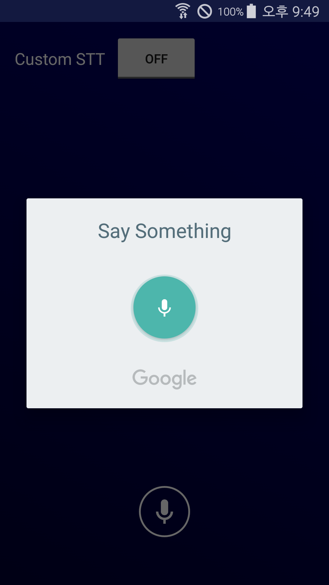

# SpeechToText with Google for Android

구글이 제공하는 Intent를 직접 호출하여 결과를 얻어오는 방법과 Custom하게 만들 수 있게 도와주는SpeechRecognizer Class를 활용해 입력되는 음성을 텍스트로 변환하는 프로젝트이다.


## 1. 사용법

### 1. Intent 호출 방법

아무래도 Custom하게 사용하는 방법보단 비교적 간단하다.
`startActivityForResult(Intent intent, int requestCode)` 메소드를 통해 Intent를 호출하여 
`onActivityResult(int requestCode, int resultCode, Intent data)` 메소드에서 결과를 표시할 수 있다. 또한 RecognizerIntent.EXTRA_LANGUAGE를 통해 원하는 나라 언어를 선택할 수 있다.

```

private final int REQ_CODE_SPEECH = 100;

@Override
protected void onCreate(Bundle savedInstanceState) {
    Intent intent = new Intent(RecognizerIntent.ACTION_RECOGNIZE_SPEECH);
    intent.putExtra(RecognizerIntent.EXTRA_LANGUAGE_MODEL,
            RecognizerIntent.LANGUAGE_MODEL_FREE_FORM);
    intent.putExtra(RecognizerIntent.EXTRA_LANGUAGE, language);
    intent.putExtra(RecognizerIntent.EXTRA_PROMPT, "Say Something");
    startActivityForResult(intent, REQ_CODE_SPEECH);
}

@Override
    protected void onActivityResult(int requestCode, int resultCode, Intent data) {
        super.onActivityResult(requestCode, resultCode, data);
        if(requestCode == REQ_CODE_SPEECH) {
            if(resultCode == RESULT_OK && data != null) {
                ArrayList<String> result = data.getStringArrayListExtra(RecognizerIntent.EXTRA_RESULTS);
                textViewSpeechResult.setText(result.get(0)); //결과 표시
            }
        }
    }

```

### 2. SpeechRecognizer 사용

SpeechRecognizer Class를 사용하지만 위 Intent 호출방법과 비슷하게 Intent객체는 생성해주어야 합니다.
다만 직접 Intent를 호출하는 것이 아닌 speechRecognizer의 메소드 중 하나인 `startListening(Intent intent)`에 생성한 Intent객체를 인자로 넘겨준다.


```

private SpeechRecognizer speechRecognizer;
private Intent intentSpeech;

@Override
protected void onCreate(Bundle savedInstanceState) {
    
    speechRecognizer = SpeechRecognizer.createSpeechRecognizer(this);
	
    intentSpeech = new Intent(RecognizerIntent.ACTION_RECOGNIZE_SPEECH);
    intentSpeech.putExtra(RecognizerIntent.EXTRA_LANGUAGE_MODEL,
    RecognizerIntent.LANGUAGE_MODEL_FREE_FORM);
    intentSpeech.putExtra(RecognizerIntent.EXTRA_LANGUAGE, Locale.KOREAN);
    
    speechRecognizer.startListening(intentSpeech); //음성 인식 시작
    
    speechRecognizer.stopListening(); //음성 인식 정지
}
    
```

### 3. SpeechRecognizer 관련 Callback 호출

Intent를 직접 호출하면 아래와 같은 Callback을 받을 필요가 없지만 Custom하게 만들기 때문에 각각의 Callback 상황에 맞춰 처리를 해주어야 한다. 구글 문서를 통해 각각의 callback메소드들이 어떤 때에 나타나는지 간략히 주석으로 설명을 달았다.

```
private RecognitionListener recognitionListener = new RecognitionListener() {
        
    @Override
    public void onReadyForSpeech(Bundle params) {
        //startListening()호출 후 음성이 입력되기 전 상태
    }

    @Override
    public void onBeginningOfSpeech() {
        //음성이 입력되고 있는 상태
    }

    @Override
    public void onRmsChanged(float rmsdB) {
        //사운드 레벨이 변경된 상태
    }

    @Override
    public void onBufferReceived(byte[] buffer) {
        //많은 소리가 수신된 상태
    }

    @Override
    public void onEndOfSpeech() {
        //음성 인식을 마친 상태
    }

    @Override
    public void onError(int error) {
        //네트워크 혹은 인식 오류가 발생한 상태
    }

    @Override
    public void onResults(Bundle results) {
        //음성 인식을 마치고 결과가 나온 상태
        ArrayList<String> result = results.getStringArrayList(SpeechRecognizer.RESULTS_RECOGNITION);
        Log.d(TAG, result.get(0));
    }

    @Override
    public void onPartialResults(Bundle partialResults) {
        //부분적으로 인식 결과를 사용하기 위한 상태
    }

    @Override
    public void onEvent(int eventType, Bundle params) {
        //향후 이벤트를 추가하기 위해 예약된 상태
    }
};

speechRecognizer.setRecognitionListener(recognitionListener);
```

## 2. 프로젝트

해당 프로젝트는 STT Class를 생성하여 조금 더 사용하기 편하도록 만들어두었다.


## 3. 스크린샷


